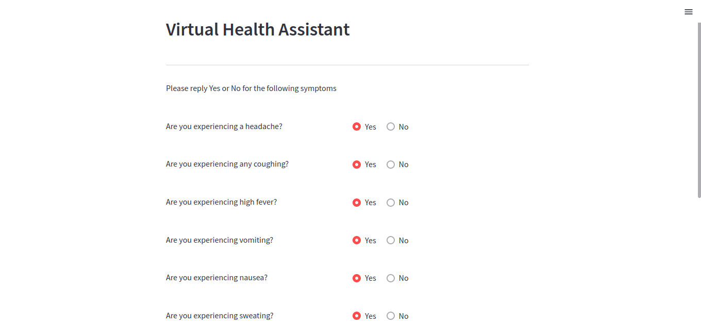
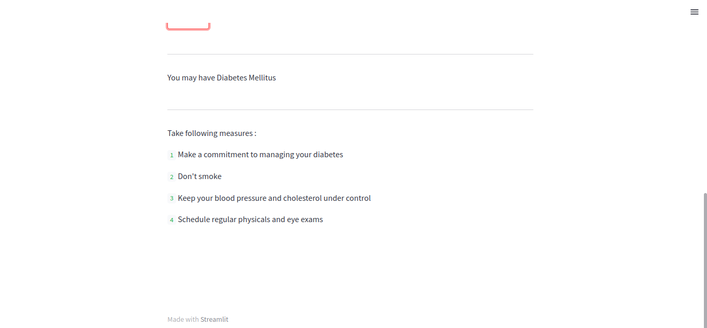

# Symptom-Checker
The symptom checker is a program that predicts the illness that the patient may be suffering from based on the symptoms provided. It directs you to the precautions you can take to control the illness. The symptoms are addressed in a yes-or-no format within a Streamlit form that is submitted to the app.

## Home Page ##
The pictures as shown depict the outlook of the web app
## Form page ##

## Results page ##

## Getting started ##
To run this application:

* Clone from here [Symptom Checker](https://github.com/Ngaremaina/Symptom-Checker)
* Run this command to start the Streamlit app: streamlit run app.py

# Author #
Ngare Maina

